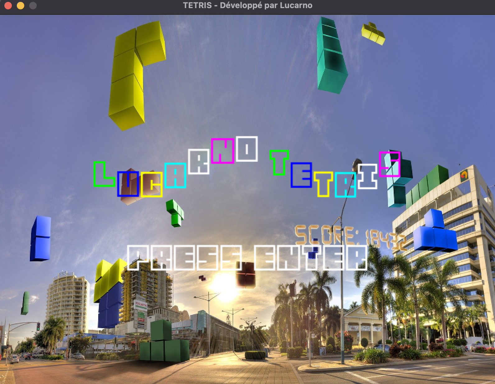
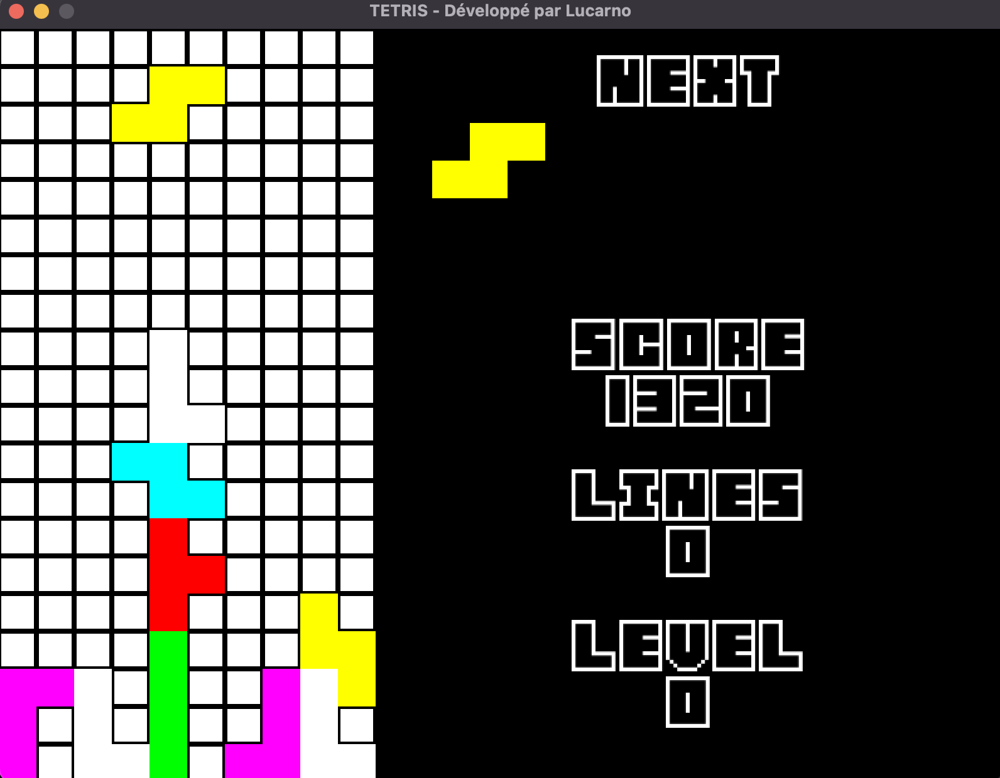
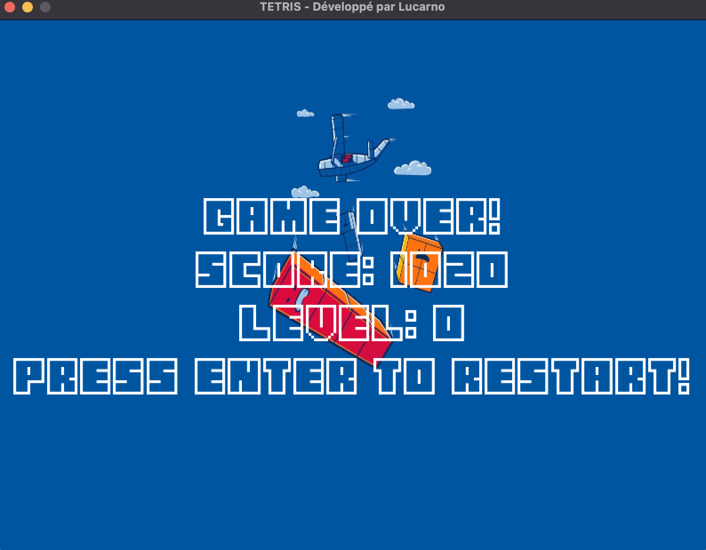

# tetris-lua
## Présentation du projet Tetris

Le jeu Tetris est un classique intemporel qui a captivé des millions de joueurs à travers le monde. Inspiré du puzzle russe, Tetris met à l'épreuve votre réflexion, votre agilité mentale et votre capacité à anticiper.

Dans ce projet réalisé avec Lua, j'ai recréé l'expérience addictive du Tetris en utilisant ce langage de programmation puissant et flexible. Le jeu propose des graphismes simples mais captivants, avec des blocs colorés qui tombent du haut de l'écran.

Voici quelques captures d'écran du jeu :

